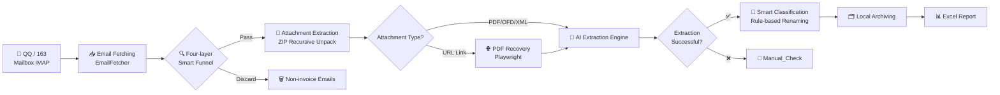
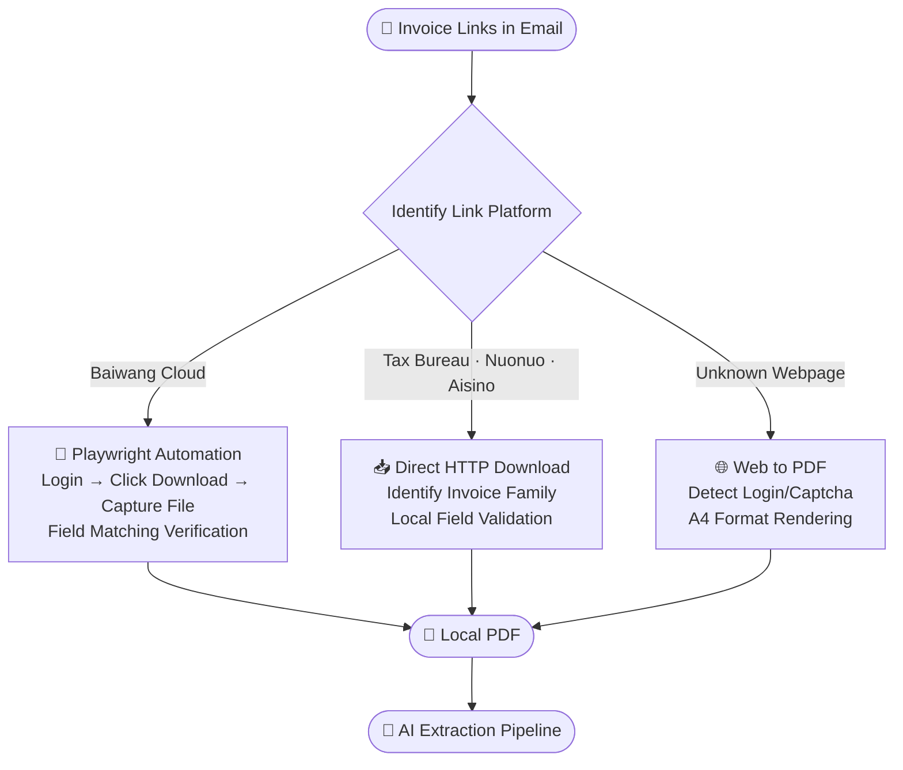

# InvoiceFlowAI — AI-Driven Automatic Invoice Archiving Assistant

<div align="center">

**English** | [中文](README_zh.md)

</div>


<div align="center">


**Connect your QQ / 163 mailbox → AI fully automatic invoice scanning → Archive by category locally → Generate Excel summary**

*The entire process requires no manual intervention; all data is stored locally with zero privacy risk*

</div>

---

## 🎬 Video Introduction

https://github.com/EthanYoQ/Invoice-Downloader/raw/codex/add-readme-video/docs/intro-video.mp4

---

## ✨ Key Highlights

| &nbsp; | Feature | Description |
|--------|---------|-------------|
| 🔒 | **One-click launch, ready to use** | Extract and run — no need to install Python or any dependencies |
| 🤖 | **Dual-engine AI recognition** | Track A (OCR precision flow) + Track B (vision fallback flow), automatic switching with no manual operation needed |
| 🔍 | **Four-layer smart funnel** | Whitelist domains → Subject keywords → Body detection → QR code scanning, precisely filtering non-invoice emails |
| 📄 | **Link-based invoice auto-recovery** | Playwright automatically opens Baiwang Cloud and tax platform links, downloading official PDF archives |
| 🗂️ | **Natural language classification rules** | Supports custom rules like "Didi rides over 100 yuan go into the high-amount category" |
| 📊 | **One-click Excel report** | Automatically generates `summary_report.xlsx`, covering invoice lists and amount summaries |

---

## 🏗️ Overall Workflow



---

## 🤖 Dual-Engine AI Extraction Architecture

The system employs **Track A + Track B + Local Fallback** as a three-layer defense. If any layer succeeds, its result is adopted, ensuring an extremely high recognition success rate.


> **Why this design?**
> - **Track A** (OCR + LLM): Highest precision — extracts text structure first, then understands it
> - **Track B** (glm-4.5V Vision): Directly "looks at the image" — ideal for complex layouts or image-based invoices
> - **Local Fallback**: Local regex rules — works offline with zero API consumption

---

## 🔍 Four-Layer Smart Filtering Funnel

The system does not call AI for every email. Instead, it first passes through a four-layer funnel for precise filtering, significantly reducing false recognition rates and API costs.


After passing the filter, attachments also go through a **three-tier decision process**:

| Tier | Trigger Condition | Handling |
|------|-------------------|----------|
| 🗑️ **Tier A** (Discard) | Tracking pixels, logos, decorative images (≤32px) | Skipped directly |
| 📦 **Tier B** (Hold) | Attachments >5MB, ZIP unpack failure | Retained but not processed |
| ✅ **Tier C** (Archive) | Normal PDF/OFD/XML | Enters AI extraction pipeline |

---

## 🌐 Three-Tier PDF Recovery Strategy

Many invoice emails only contain "click to download" links. The system automatically identifies the platform and selects the optimal approach:



---

## ⚙️ Configuration Guide

> Only needs to be configured once on first use; after that, just click run for each scan.

### Step 1 · Enable 163 Mailbox IMAP

<details>
<summary>📖 Click to expand detailed steps for 163 mailbox</summary>

**Server Parameters**

| Parameter | Value |
|-----------|-------|
| IMAP Server | `imap.163.com` |
| Port | `993` (SSL/TLS) |

**Setup Steps**

1. Log in to [mail.163.com](https://mail.163.com), click **Settings** in the upper right corner
2. Select **POP3/SMTP/IMAP** from the dropdown menu
3. Find **IMAP/SMTP Service**, click the **Enable** button on the right
4. An "Account Security Verification" window will appear:
   - **QR Code Method** (Recommended): Scan the QR code with your phone to automatically send a verification SMS
   - **Manual Method**: Manually send an SMS to the designated number as prompted
5. After sending the SMS, click **I Have Sent It**
6. The system generates a **16-character authorization code** (letter combination, **only displayed once — copy and save it immediately**)

> ⚠️ The authorization code is not your mailbox login password. It is a separate password specifically for third-party clients, and it is case-sensitive.

📚 [163 Mailbox Official Help](https://help.mail.163.com/)

</details>

---

### Step 2 · Enable QQ Mailbox IMAP

<details>
<summary>📖 Click to expand detailed steps for QQ mailbox</summary>

**Server Parameters**

| Parameter | Value |
|-----------|-------|
| IMAP Server | `imap.qq.com` |
| Port | `993` (SSL/TLS) |

**Setup Steps**

1. Log in to [mail.qq.com](https://mail.qq.com), click the **Settings** icon in the upper right corner
2. Select the **Account** tab
3. Find **POP3/IMAP/SMTP/Exchange/CardDAV/CalDAV Service**
4. Click **Manage Service** → **Enable Service**
5. Click **Generate Authorization Code** and complete identity verification:
   - **QR Code Method** (Recommended): Scan the QR code with your phone to automatically send a verification SMS
   - **Manual Method**: Send "Configure Email Client" to **1069070069** using your QQ-linked phone
6. Click **I Have Sent It** — the authorization code is generated instantly after verification (**save it immediately**)

> ⚠️ The authorization code automatically becomes invalid after changing your QQ password and must be regenerated.

📚 [QQ Mailbox Official Help](https://service.mail.qq.com/detail/0/339)

</details>

---

### Step 3 · Obtain Zhipu GLM API Key

<details>
<summary>📖 Click to expand GLM API configuration steps</summary>

The system uses **GLM-4.5V** (multimodal vision) and **GLM-OCR** to recognize invoice content.

**Steps**

1. Visit [open.bigmodel.cn](https://open.bigmodel.cn/) and register an account
2. Go to Console → **API Keys** → **Create API Key**
3. Copy and save the Key (format: `xxxxxxxx.xxxxxxxxxxxxxxxx`)

**Cost Reference**

| Scenario | Description |
|----------|-------------|
| 🎁 New User Bonus | 5 million GLM-4 tokens gifted (valid for 30 days) |
| 💰 Recommended Top-up | **Under 5 yuan**, pay-as-you-go |
| 📊 Usage Estimate | Each invoice consumes approximately 1,000–3,000 tokens; for 200 invoices/month, 5 yuan lasts about 12 months |

📚 [Zhipu AI Open Platform](https://open.bigmodel.cn/)

</details>

---

## 🚀 Quick Start

```
Step 1  Extract the software package to a regular folder (avoid cloud sync directories)
        Keep the _internal folder in the same directory as InvoiceFlowAI.exe
        ↓
Step 2  Double-click to run InvoiceFlowAI.exe
        The settings interface automatically appears on first launch
        ↓
Step 3  Fill in the configuration and save:
        · Email address + authorization code (QQ or 163)
        · GLM API Key
        ↓
        Click "Start Scanning" → Wait for completion
        Invoices are automatically archived to the "Invoice Organizer" folder on your desktop ✅
```

---

## 📁 Output Directory Structure

```
Invoice Organizer/
├── Train Tickets/
│   └── 20260315-Beijing-Shanghai-Train-Ticket.pdf
├── Flight Tickets/
│   └── 20260301_Flight_1280.00_Air-China.pdf
├── Accommodation/
│   └── 20260310_Accommodation_888.00_Beijing-Hilton.pdf
├── Taxi/
│   └── 20260312_Taxi_45.50_DiDi.pdf
├── Dining/
├── Manual_Check/      ← Cannot be recognized by AI, requires manual processing
└── summary_report.xlsx
```

---

## ❓ FAQ

<details>
<summary>Q: White screen or no response after launching the software?</summary>

- Make sure the **entire archive is extracted**; the `_internal` folder must be in the same directory as `InvoiceFlowAI.exe`
- Avoid placing the software in a directory containing **Chinese characters or spaces**

</details>

<details>
<summary>Q: Very few invoices found after scanning?</summary>

- In the software's time range settings, **adjust the start date to more than 180 days ago**
- Some mailboxes default to fetching only the last 30 days of emails — select "Fetch all emails" in the mailbox IMAP settings

</details>

<details>
<summary>Q: Authentication failure after entering the authorization code?</summary>

- **QQ Mailbox**: Must be obtained through "Manage Service → Generate Authorization Code" — it is **not your QQ password**
- **163 Mailbox**: Must be generated from the "Enable IMAP Service" popup — it is **not your mailbox login password**, and it is case-sensitive
- The QQ authorization code must be regenerated after changing your QQ password

</details>

<details>
<summary>Q: GLM API reports insufficient balance?</summary>

Log in to [open.bigmodel.cn](https://open.bigmodel.cn/) → Billing Center → Top Up. Recommended top-up of **5 yuan**, pay-as-you-go.

</details>

<details>
<summary>Q: Some invoices end up in the Manual_Check folder?</summary>

This is normal. When AI recognition confidence is insufficient, the system automatically places invoices in the `Manual_Check` queue for manual confirmation. This is usually caused by blurry images, non-standard documents, or encrypted PDFs.

</details>

---

## 🛡️ Privacy & Security

- All emails and invoice files are processed **locally** and are never uploaded to any server
- Mailbox credentials are encrypted and stored via **Windows DPAPI**, decryptable only by the current Windows account
- The GLM API only receives **invoice images** (Base64) for text recognition and does not send the original email content

---

## ⚠️ Disclaimer

By using this software, you acknowledge and accept the following terms.

**Compliant Use** · This software accesses mailboxes through IMAP in **read-only** mode. It does not send, delete, or modify any emails. Users must ensure they have legitimate authorization for the mailboxes being processed.

**Accuracy** · AI recognition has a certain error rate. **Do not use the output results directly for formal financial or tax filings** — manual review is required. The developer assumes no liability for any losses caused by recognition errors.

**Data** · When calling the GLM API, invoice images are sent to Zhipu AI servers for recognition, subject to the [Zhipu AI Privacy Policy](https://www.zhipuai.cn/zh/privacy). Original email content is never sent.

**Third-Party Services**

| Service | Purpose | Provider |
|---------|---------|----------|
| Zhipu GLM API | Invoice OCR and visual recognition | Beijing Zhipu Huazhang Technology Co., Ltd. |
| QQ Mailbox IMAP | Email reading | Tencent Technology (Shenzhen) Co., Ltd. |
| 163 Mailbox IMAP | Email reading | NetEase (Hangzhou) Network Co., Ltd. |

---

## 📜 License

[CC BY-NC 4.0](https://creativecommons.org/licenses/by-nc/4.0/deed.en) · ✅ Personal use, learning and research · ❌ Commercial use prohibited

---

<div align="center">

Made with ❤️ by **Ethan-YQ**

[Report Issues](https://github.com/Ethan-YoungQ/Invoice-Downloader/issues) · [Zhipu AI Open Platform](https://open.bigmodel.cn/) · [163 Mailbox Help](https://help.mail.163.com/) · [QQ Mailbox Help](https://service.mail.qq.com/detail/0/339)

</div>
